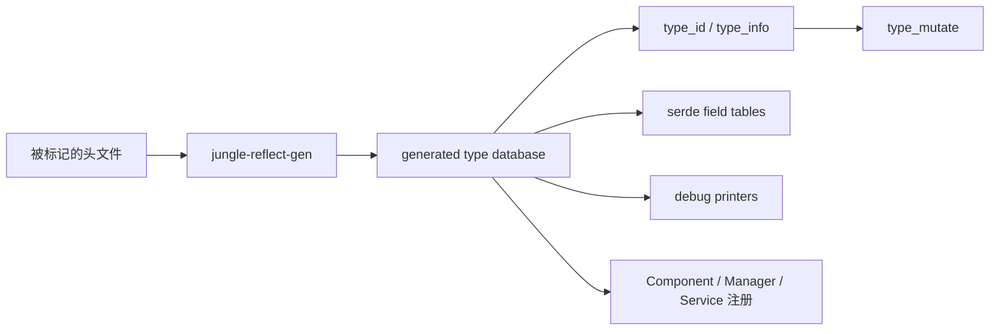

# 预生成反射与类型系统重构方案

状态：草案，备用。尚未实施。

本文记录把 Jungle 从 C++26 原生反射迁到编译前预生成反射，并一并重做 `type_id` / `type_mutate` 的终态方案。目标是主工程可降到 C++23；中间不保留「原生反射 / 预生成」双轨开关。

---

## 1. 目标与非目标

### 1.1 目标

- 引擎代码不再依赖 C++26 原生反射：`^^`、`[: :]`、`<meta>`、`std::meta::*`、`[[=...]]`、`std::define_static_array`。
- 用编译前预生成得到一份封闭的类型数据库，作为 `type_id`、serde、debug、ECS 注册的唯一来源。
- 把现有过薄的 `type_id` / `type_mutate` 做成可查询、可路由、可安全转型的类型系统。
- 预生成落地且引擎侧零 `std::meta` 之后，再把 `CMAKE_CXX_STANDARD` 从 26 改为 23，去掉 `-freflection`。

### 1.2 非目标

- 不恢复 RTTI / 异常。
- 不把反射做成运行时脚本对象模型（没有动态加字段、没有解释执行）。
- 不保留「任意未登记 class 都能 serde / debug」的开放世界语义。原生反射才有该能力；预生成做不到，也不用宏或开关假装还能做到。
- 不把 `template for` 这类非反射的 C++26 扩展混进反射方案里悄悄放过。它是降标准的另一条必做项，见第 8 节 Phase 5。

### 1.3 原则

- 终态一次到位。不为「改动更小」保留过渡形态。
- 不引入「是否使用原生反射」之类的可配置开关。
- 引擎代码假设类型数据库已经是当前结构；生成器负责从源码标记产出数据库，不把扫描细节泄漏进 serde / ECS。
- 身份、字段表、注册键共用同一份类型数据库，不再平行维护 `identifier_of` 字符串和 `type_id` 指针。

---

## 2. 现状

原生反射不是一个模块，而是散落在类型身份、序列化、调试、注册四条链路上。

### 2.1 编译期反射 API

| 能力 | 位置 | 用途 |
| --- | --- | --- |
| 注解查询 | `jungle-base/include/jungle/meta.h` | `has_annotation` / `has_template_annotation` / `nth_template_annotation_argument_of` |
| 模板特化判断 | 同上 | `is_specialization_of_template`（serde 的 `optional`、`future_type`、`join_handle_type`） |
| 成员遍历 | `serde/serialize.h`、`serde/deserialize.h`、`debug.h` | 非静态数据成员，含私有字段（`access_context::unchecked()`） |
| 枚举遍历 | `unit_tests/text.h`、`serde_jaml.h`、`debug.h` | 名字 ↔ 值 |
| 类型名 | `util/type_id.h`、Manager / Service 注册 | `display_string_of` / `identifier_of` |

serde 注解语义在 `jungle-base/include/jungle/serde/serde.h`：

- `[[=customized]]`：opt-in 字段列表
- `[[=field]]`：参与 serde
- `[[=customize<C>]]`：字段定制器

### 2.2 `type_id` 过薄

当前实现（`jungle-base/include/jungle/util/type_id.h`）：

- 身份 = 每类型一个 `static u8` 的地址
- 名字 = 编译器 `display_string_of`，不可跨编译器，不宜当资产键
- 没有 size / align / kind / 字段 / 枚举 / 构造销毁
- 不能按名反查
- Debug 下 `==` 额外比名字，Release 只比指针
- 赋值用析构 + placement new，对这种平凡对象没有意义

它现在只够当 `hash_map` 的键，见 `application.h`、`level.h`。

### 2.3 `type_mutate` 过薄

CRTP 基类里存一个 `type_id`，再配 `static_mutatable<U>`：

- 派生类构造时手工传入 `type_id::of<Derived>()`，传错就静默坏掉
- `as<U>()` 只是 `static_cast`，Release 无检查
- 没有族内 visit、没有类型描述符、没有「最派生类型」自动绑定
- 三个家族各自为政：`Component<>`、`Manager<>`、`Service`

### 2.4 运行时注册仍靠反射取名

- `manager.h`：`string_id{std::meta::identifier_of(^^C)}`
- `service.h`：同样用 `identifier_of(^^S)`
- 宏 `jungle_core_ecs_register_component` / `jungle_core_service_register` 只负责把 creator 塞进全局表

名字系统和 `type_id` 是两条平行身份，预生成后必须收束。

### 2.5 降到 C++23 时，反射不是唯一障碍

`template for` 还用在非反射代码里：

- `jungle-base/include/jungle/algebra/matrix.h`
- `jungle-core/include/jungle/core/ecs/component_storage.h`
- `jungle-tasks/src/tasks/runtime/scheduler.cpp`

这些与反射方案独立，但必须在切 `CMAKE_CXX_STANDARD 23` 前改掉。`is_specialization_of_template` 也不需要反射，C++23 用偏特化 trait 就能写。

---

## 3. 终态架构

把「编译器临时知道的类型」变成「仓库里一份显式类型数据库」。



### 3.1 分层

| 层 | 职责 | 编译期依赖 |
| --- | --- | --- |
| 标记层 | 类型声明自己可反射、字段策略、定制器 | 仅 C++23 |
| 生成器 | 读标记，写出数据库 | 过渡期可用 C++26 反射；切标准后改 AST/libclang，或继续作为独立工具链 |
| 运行时反射库 | `type_id` / `type_info` / field / enumerator / accessor | 纯 C++23，无 `<meta>` |
| 消费层 | serde、debug、ECS、service | 只问数据库，不再问编译器 |

生成物放构建目录，由 CMake `add_custom_command` 产生，不入库。头文件变更 → 生成器重跑 → 依赖它的翻译单元重编。

### 3.2 语义变化（必须接受）

原生反射是开放世界：任意 class 都能 `serialize` / `debug`。预生成是封闭世界：

- 组合子类型（`bool` / 整数 / 浮点 / `enum` / `optional<T>` / `range`）继续由框架泛型处理。
- 用户 class / enum 必须进入类型数据库，否则 `serialize` / `debug` / `type_id::of<T>()` 直接编译失败。
- 私有字段通过生成的 `accessor<T>` 访问，不再 `unchecked()`。

这不是过渡态，就是终态。serde 文档里「零外部代码生成」要改成「零手写遍历，类型表由生成器维护」。

---

## 4. 类型数据库

### 4.1 `type_id`：薄句柄

```text
type_id
  - 指向静态 type_info 的指针（进程内身份）
  - of<T>()          由生成特化提供，constexpr，不再 consteval + ^^
  - none()
  - name()           非限定名，稳定，等于当前 identifier_of 的角色
  - qualified_name() 含命名空间，供诊断
  - string_id()      由 name 算出，直接替代 Manager/Service 的手搓 string_id
  - hash / ==        只比指针，Debug/Release 一致
  - 去掉 placement-new 赋值
```

`type_id` 仍然是 `hash_map` 的键，但不再自己藏 `static u8`。身份来自生成器发出的唯一 `type_info` 对象。

不要用「编译器 display string」当身份；不要用跨进程稳定整数当默认身份。资产 / 网络若需要类型键，用 `name()` / `string_id()`，并继续靠现有 `build_id` 约束同一构建。

### 4.2 `type_info`：厚描述符

每个登记类型一份静态数据：

- `kind`：fundamental / enum / class / template_specialization
- `size` / `align`
- `name` / `qualified_name`
- `type_id` 自身
- class：字段表（名字、offset 或 accessor、字段 `type_id`、serde 策略、customizer）
- enum：enumerator 表（名字、值）
- 可选函数指针：`debug`、默认构造、析构（只给真正需要类型擦除的家族用，不给所有类型强行生成）

模板特化（`Manager<Health>`、`optional<int>`）也是数据库里的一等类型。`type_id::of<Manager<C>>()` 必须继续可用，因为 `level.h` 用它做键。

### 4.3 访问器，而不是 `obj.[:m:]`

每个反射 class 声明：

```cpp
friend struct jungle::reflect::accessor<Health>;
```

生成器写：

```cpp
template<>
struct jungle::reflect::accessor<Health> {
    static auto &hp(Health &o) { return o.hp; }
    static const auto &hp(const Health &o) { return o.hp; }
};
```

serde / debug 只通过 accessor 读写。这样私有成员、非标准布局都能用，避免 `offsetof` + `reinterpret_cast` 的 UB。

### 4.4 `type_mutate`：自动绑定最派生类型

终态不再让派生类手传 `type_id`。

```text
type_mutate<Base>           擦除端：存 const type_info*
type_mutate<Base, Derived>  具体端：默认构造就写入 type_of<Derived>()
```

`Component<C>` / `Manager<C>` / `Service` 具体类继承 `type_mutate<Base, Derived>`，构造函数不再写 `type_id::of<C>()`。

保留并收紧现有安全层：

| 层 | 机制 | 行为 |
| --- | --- | --- |
| 编译期 | `static_mutatable<U>` | 非法 `as<Wrong>()` 编译失败 |
| Debug | `JUNGLE_ASSERT(is<U>())` | 失败 `panic()` |
| Release | 无断言 | 仍是 `static_cast`，文档写明 UB |
| 安全路径 | `try_as<U>()` | 不匹配返回 `nullptr` |

新增（因为终于有类型表）：

- `type_info()`：从实例拿到完整描述符
- `is(type_id)` 继续给数据驱动路由用
- **不**在 `type_mutate` 里做全组件 `visit`。组件集是开放家族，visit 属于游戏 / Level 的生成表，不是基类的事

`static_mutatable` 继续用 concept（`ComponentImpl` / `ComponentManager` / `ServiceImpl`），不要改成生成出来的类型列表；生成器不知道用户稍后才写的组件。

---

## 5. 类型如何进入数据库

开放世界没了，必须有显式 opt-in。标记要 C++23 合法，且能表达现在的 serde 注解。

推荐类内 friend + 类外描述，不用 `[[=]]`：

```cpp
struct Health : Component<Health> {
    friend struct jungle::reflect::accessor<Health>;
    int hp;
    float regen;
    int scratch;
};
JUNGLE_REFLECT(Health) {
    .fields = {
        field<&Health::hp>("hp"),
        field<&Health::regen>("regen"),
        skip<&Health::scratch>(),
    };
};
```

对应今天的注解：

| 今天 | 终态 |
| --- | --- |
| 无注解 class → 全部字段 | `JUNGLE_REFLECT(T)` 且默认 all fields（生成器按声明序收录） |
| `[[=customized]]` + `[[=field]]` | `JUNGLE_REFLECT(T, opt_in)` + 只列参与字段 |
| `[[=customize<C>]]` | `field<&T::m, customize<C>>("m")` |
| 枚举 | `JUNGLE_REFLECT_ENUM(Color)`，生成器收全部 enumerator |
| 无标记 | `type_id::of<T>()` / serde / debug 编译失败 |

`JUNGLE_REFLECT` 宏只做两件事：声明 `accessor` 特化、把类型挂进「本 TU 反射清单」。字段表可以是宏参数，也可以是紧跟其后的 `constexpr` 描述块。不要再发明一套并行的 attribute。

生成器输入 = 这些标记，而不是盲扫所有 class。这样 `std::vector`、第三方类型不会被误收入库。

对引擎内部已有类型（Entity、各 Component、Service、测试夹具），迁移时一次性补齐标记，不要留「有的靠原生反射、有的靠生成」。

---

## 6. 生成器与 CMake

### 6.1 过渡期：用现有 GCC 反射当生成器

在真正改 `CMAKE_CXX_STANDARD` 之前，生成器本身仍用 C++26 + `-freflection` 编译。这是最能保住当前语义的办法：成员顺序、私有成员、模板特化名、`identifier_of` 都与现在一致。

流程：

1. CMake 收集带 `JUNGLE_REFLECT*` 的头（或显式列出模块反射入口）。
2. 生成一份 `reflect_scan.cpp`：include 这些头，对类型清单做 `^^T` 遍历，把 `type_info` 以 C++23 源码写到 `build/.../generated/`。
3. `jungle-base` / `jungle-core` 把生成头加进 include path，引擎代码只 include 生成 API，不再 include `<meta>`。

这一步结束时：引擎是「C++26 编译 + 零原生反射用法」；生成器是唯一还碰 `std::meta` 的目标。

### 6.2 切 C++23 时生成器怎么活

两条里选一条，不要并存：

- **A（推荐）**：生成器继续作为独立可执行文件，用单独的 `CXX_STANDARD 26` 目标编译。主工程 23，工具 26。前提是工具链里还留得住这台 GCC。
- **B**：生成器改成 libclang / Python AST，主工程和工具都不再要 `-freflection`。

A 更短、语义更真；B 更彻底。建议 Phase 5 先走 A 把标准降下来，B 作为后续工具链解耦，不堵在这次重构的关键路径上。

### 6.3 CMake 形态

- 新函数例如 `jungle_reflect_module(<target> HEADERS ...)`。
- 输出：`type_db_<target>.h` + `type_db_<target>.cpp`（静态 `type_info` 数组、`type_of<T>` 特化、accessor）。
- PCH：生成头很大，不要塞进现有 `cmake/GeneratePch.cmake` 的全量扫描；按模块 include 生成的聚合头。
- 依赖：头文件 / 标记变更必须让生成器重跑。用 `CONFIGURE_DEPENDS` 或显式 `OBJECT_DEPENDS`。

不要做 `JUNGLE_USE_NATIVE_REFLECTION` 这类开关。扫描器还在的时候，引擎代码已经只走生成 API。

---

## 7. 消费点迁移

顺序固定：先数据库，再身份，再 serde / debug，再 ECS 注册，最后删 `<meta>`。每一层迁完，上一层的 `std::meta` 就必须消失，不能双实现。

### 7.1 替换 `meta.h`

| 现函数 | 去向 |
| --- | --- |
| `has_annotation` 等 | 删除。serde 策略写进字段表 |
| `nonstatic_data_members_with_annotation` | 删除。生成器已经筛过 |
| `is_specialization_of_template` | 改成普通 trait，放到 `concepts.h` 或 `types/`，不走生成器 |

`jungle::meta` 这个命名空间如果还在，就只表示「类型数据库查询」，不要继续假装是 `std::meta` 包装。推荐直接删除该头，避免旧名复活。

### 7.2 serde

`serialize.h` / `deserialize.h` 的 class 分支改为：

```text
取 type_info_of<T>()
写 class_head(info.name)
for field in info.serde_fields:
    写 field.name
    若有 customizer → 调生成好的 customizer 特化
    否则 serialize(accessor<T>::field(obj), subtarget)
```

分派顺序保持今天文档里的 7 段：bool → integral → floating → enum → optional → range → class。`optional` 用 trait，不再 `^^std::optional`。

enum 反序列化（`text.h`、`serde_jaml.h`）改为查 enumerator 表。

测试里所有 `[[=...]]` 和 `std::meta::annotations_of` 的 `static_assert` 改成断言生成表内容。行为测试（标记字段、定制器、往返）应保持同一组用例，只换标记语法。

### 7.3 `debug()`

`debug.h` 对 class / enum 走类型表；fundamental / range / `formattable` 仍用现有分支。未登记 class 编译失败，不再 `static_assert(false, "Unsupported type")` 那种运行到分支才爆。

实现 `concepts::Debug` 的类型继续走 `T::debug()`，优先级不变。

### 7.4 ECS / Service

- `Component<C>`、`Manager<C>`、各 `Service` 子类改为 `type_mutate<Base, Derived>`，去掉手写 `type_id::of<...>()`。
- 注册表键从「现场 `identifier_of`」改为 `type_id`。Level 已经用 `type_id` 当键；Service / Manager 的 `string_id` 表应与它对齐。
- 推荐 Service / Manager 注册表都改成 `hash_map<type_id, Creator>`。名字只用于诊断和数据驱动查找的旁路索引。
- `jungle_core_ecs_register_component` 仍负责动态注册，但 creator 里的名字不再调 `std::meta`。

### 7.5 `type_id::of` 的覆盖范围

必须生成（否则现有代码编不过）：

- 所有 Component 实现、`Manager<C>`、所有 Service
- 所有 serde / debug 测到的 struct / enum
- 被当作 `hash_map` 键使用的类型

不必生成：纯模板组合子（`vector<T>` 由 range 分支处理）、未参与身份 / serde / debug 的内部类。

---

## 8. 分阶段落地

每一阶段都有可独立合并的结束条件。阶段之间不留双轨。

### Phase 0 — 冻结反射语义

- 列出所有 `std::meta` / `^^` / `[[=` / `[:` 调用点（本文第 2 节即初稿）。
- 记下 serde 字段顺序、私有字段、定制器、Manager 名字字符串的可观察行为，作为迁移不变量。
- 明确：`template for` 非反射用法另表跟踪。

结束条件：清单进文档或 issue，不改代码。

### Phase 1 — 反射运行时库（空数据库也能编译）

新增 `jungle::reflect`：

- `type_id` / `type_info` / `field_info` / `enumerator_info` / `accessor`
- 新 `type_mutate<Base, Derived>`
- `type_id::of<T>()` 对未生成类型是 ill-formed（deleted / concept），不要静默回退到指针 hack

此时旧 `type_id.h` 还在。新头并存，但旧 API 不再加功能。

结束条件：新库有单元测试（手工写一份假 `type_info` 特化即可），不接生成器。

### Phase 2 — 生成器 + 第一个模块

- 实现 `jungle-reflect-gen`（C++26 扫描器）。
- CMake 接入 `jungle-base` 的 serde 测试类型。
- 用生成表重写 serde 的 class / enum 路径，删掉 serialize / deserialize 里的 `std::meta`。
- 测试夹具从 `[[=]]` 换成 `JUNGLE_REFLECT`。

结束条件：`jungle-base-unit-tests` 的 serde 全绿；`serialize.h` / `deserialize.h` 无 `<meta>`。

### Phase 3 — 替换身份系统

- 生成所有 Component / Manager / Service 的 `type_info`。
- 切换 `type_id::of` 到生成特化；删除 `static u8 identifier`。
- `type_mutate` 切到新 CRTP；Component / Manager / Service 不再手传 id。
- Level / Application 的 `hash_map<type_id, ...>` 不改语义，只换底层 `==` / hash。
- 注册表键统一到 `type_id`。

结束条件：core 单测里所有 `type_mutate_*`、manager 注册、service 启动仍过；引擎代码不再调用 `type_id::of` 的旧实现。

### Phase 4 — debug 与剩余 `identifier_of`

- `debug.h` 改类型表。
- 删掉 Manager / Service 残留的 `std::meta::identifier_of`。
- `future.h` / `join_handle.h` 的特化判断改 trait。
- 删除 `meta.h`。

结束条件：全仓库引擎代码 `std::meta` / `^^` / `[[=` 仅剩生成器目标。

### Phase 5 — 清 C++26 非反射依赖，降标准

- `template for` → 普通循环 / `index_sequence`（matrix、component_storage、scheduler）。
- 审计其它 C++26 语法（pack indexing、`std::define_static_array` 等）。
- 根 `CMakeLists.txt` 改为 `CMAKE_CXX_STANDARD 23`；`jungle-base/CMakeLists.txt` 去掉 `-freflection`。
- 生成器目标单独保留 26 + `-freflection`（方案 A），或已换成 libclang（方案 B）。
- 更新 `AGENTS.md`、中英文文档、serde / type_mutate 文档。现有 base README 里已经误写 C++23，以这次终态为准改准确。

结束条件：主库以 C++23、无 `-freflection` 编过；测试全绿。

### Phase 6 — 文档与技能

- 中英文档：预生成流程、`JUNGLE_REFLECT`、`type_id` / `type_info` / `type_mutate`。
- jungle-test skill、AGENTS 编译器说明同步。
- 删掉「零代码生成」「C++26 反射」表述。

---

## 9. `type_id` / `type_mutate` 改进对照

| | 现在 | 终态 |
| --- | --- | --- |
| 身份 | 每类型 `static u8` 地址 | 生成的 `type_info` 静态对象地址 |
| 名字 | `display_string_of`，编译器方言 | 源码标识符，稳定 |
| 可查询性 | 只有 `name()` | kind / size / align / fields / enumerators / string_id |
| 反查 | 无 | `find(name)` / `find(string_id)`（模块登记表） |
| `==` / hash | Debug 比名字，hash 转指针 | 始终比 `type_info*` |
| 赋值 | 析构 + placement new | 默认平凡拷贝 |
| `of<T>()` | 任意 T，consteval 反射 | 仅数据库中的 T，constexpr 特化 |
| mutate 绑定 | 派生类手传 id | CRTP 自动 `type_of<Derived>()` |
| mutate 能力 | is / as / try_as | 同上 + `type_info()`；注册键与身份合一 |
| 与 serde | 无关 | 同一份字段表 |

这些改进依赖预生成，不要在旧 `type_id` 上先打补丁再迁一次。

---

## 10. 风险

- **漏标记**：以前随便一个 struct 就能 serde。迁完会变成硬编译错误，这是期望行为；要在 Phase 2 把所有测试夹具和资产结构一次性标完。
- **模板特化爆炸**：`Manager<C>`、嵌套 `optional<vector<T>>` 不要对组合子生成无限特化。组合子走泛型分支；只给「有身份的用户类型」和「作为 map 键的特化」（如 `Manager<C>`）生成 `type_info`。
- **名字稳定性**：`identifier_of(^^C)` 现在是非限定名。生成器必须输出同样规则，否则 `string_id` 注册会对不上已有调用。若 Phase 3 把注册表改成 `type_id` 键，这条风险直接消失——这是推荐做法。
- **PCH / 增量**：生成文件抖动会导致大范围重编。生成器输出必须确定性（排序、无时间戳）。
- **生成器与主标准分叉**：方案 A 要求开发机始终有 C++26 GCC。若这正是降标准的原因，Phase 5 就该直接上方案 B，不要先 A 再拖。
- **`template for` 残留**：只删反射、忘了 matrix / storage，切 23 会二次爆。Phase 5 必须单独验收。

---

## 11. 验收

主工程（不含生成器目标）：

- 无 `#include <meta>`、无 `std::meta`、无 `^^`、无 `[: :]`、无 `[[=`
- 无 `-freflection`
- `CMAKE_CXX_STANDARD=23`
- `type_id::of<T>()` 对未登记 T 编译失败
- Component / Manager / Service 构造不再出现手写 `type_id::of`
- serde 往返、定制器、opt-in 字段、enum 名解析、type_mutate 单测全部保留且通过
- `hash_map<type_id, ...>` 查找行为与现在一致（同类型相等、异类型不等）

---

## 12. PR 切分

若按 PR 拆，最小有意义的序列是：

1. `jungle::reflect` 运行时 + 新 `type_mutate`（手工假数据）
2. 生成器 + serde 迁完 + 去掉 serde 的原生反射
3. `type_id` 切生成表 + ECS / Service 注册与 mutate
4. debug + 删除 `meta.h`
5. `template for` 清理 + 降标准 + 文档

第 2 步是最大块，也是唯一能证明预生成能接住现有注解语义的一步。身份系统不要插在 serde 之前，否则会先把 `type_id::of` 改成半成品。

开工应从 Phase 1 的 `jungle::reflect` API 草头开始，而不是先改 CMake 标准。
